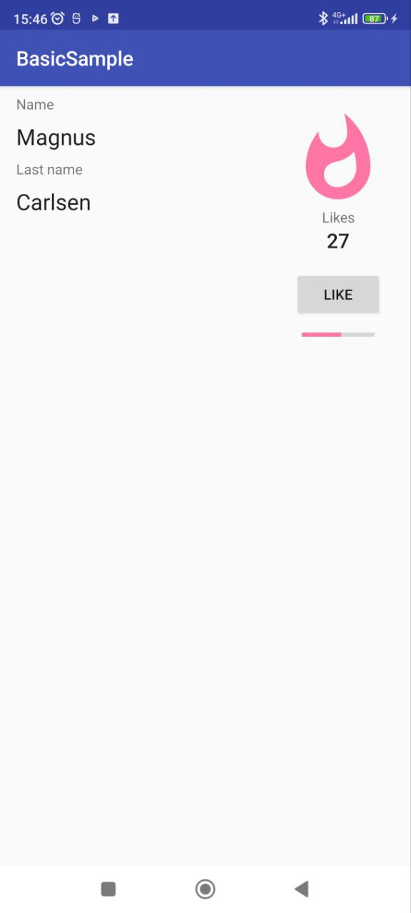

# **BasicSample** :+1::fire:
### On this repository you can find an app where you can like and watch the popularity grow

___
### :warning: The application was created as part of studying the data binding.

#### In this application, you can put likes, nothing more :x:

#### About App:
- #### Supported android versions :hammer:: 6.0 and higher
- #### Memory size :minidisc:: 12 MB

## Application screenshot:

